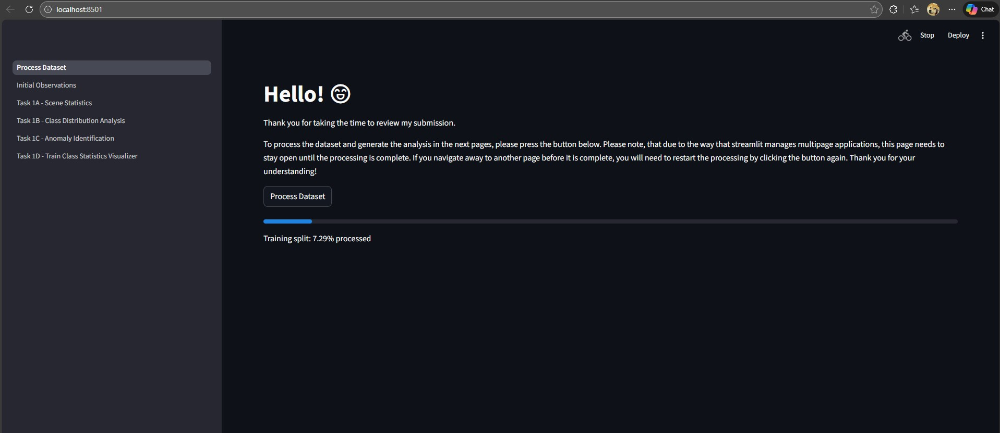
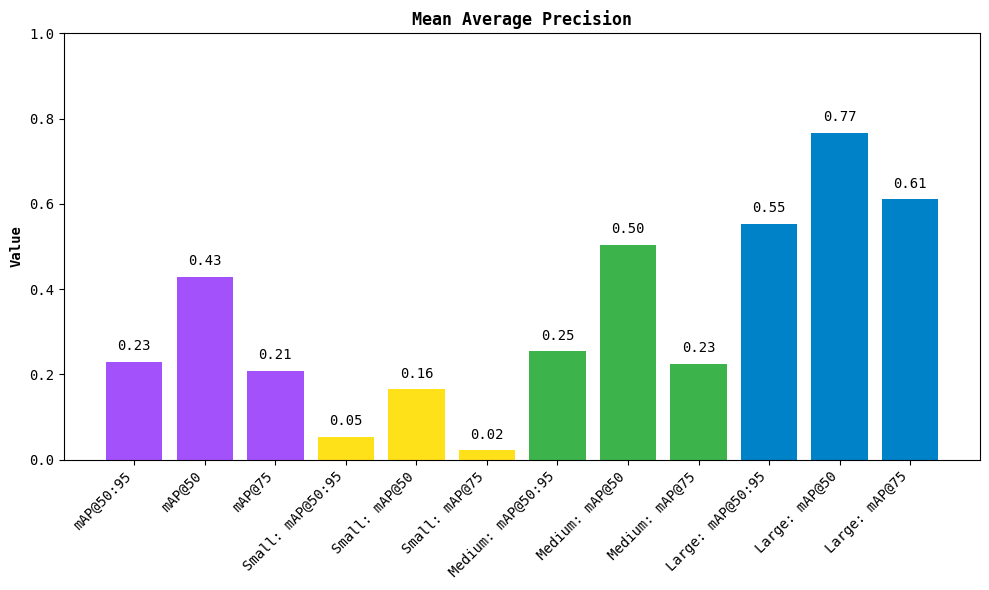
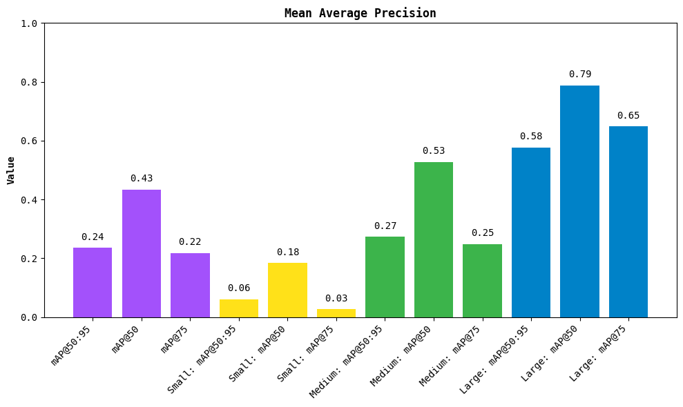
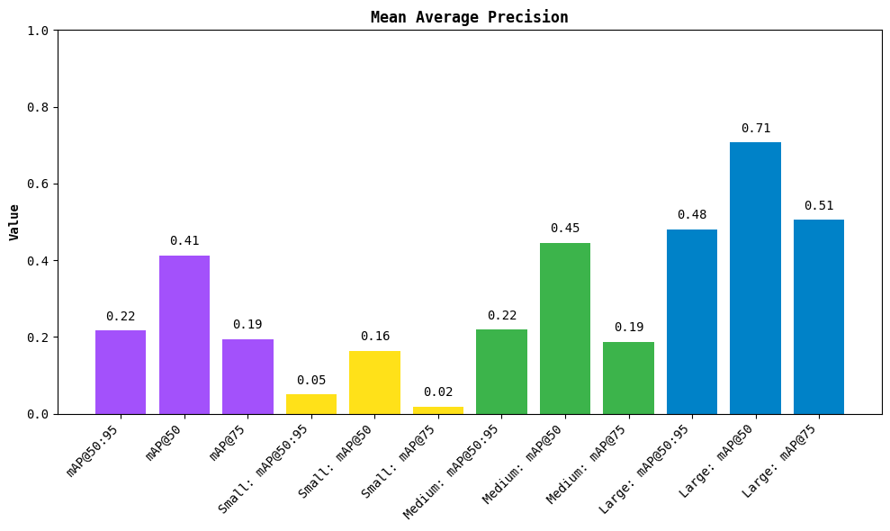
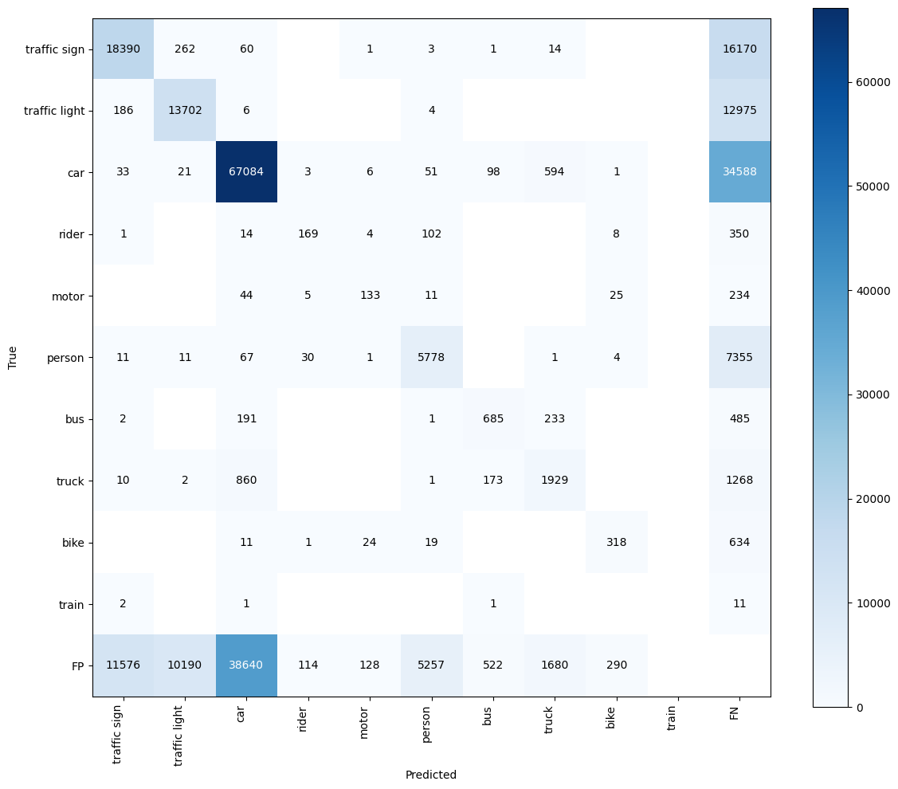
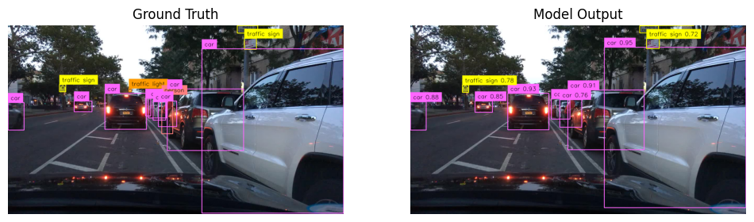
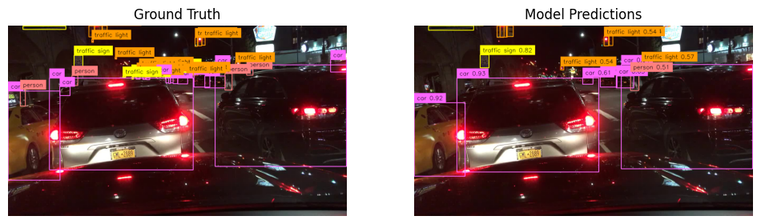
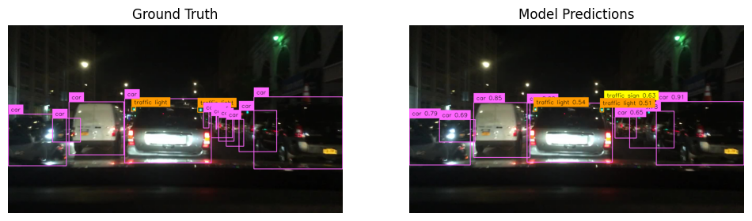

# My submission for Bosch's Applied CV Coding Assignment
[](https://github.com/plsgivecheesecake/bosch-applied-cv-assignment/actions/workflows/ci.yml)
[](https://github.com/astral-sh/uv)
- PEP8 compliance checked using Ruff and Interrogate packages
- Submitted within deadline. Final Commit: 11:45 PM IST.

## Setup
Please make sure to do the following
 - Set environment variable called BDD_DATASET_PATH with the directory path where the **EXTRACTED** contents of the assignment_data_bdd.zip file are located on your system. This can be done in one of two ways. You can either set this as an OS variable, or you can use the .env file provided in this repository. If on Windows, please make sure to escape the backslashes or just use a UNIX-style path.
 - Install Docker and Docker Compose

Once the above two steps have been completed, running the project is as simple as running 
``` docker compose up --build ``` from the root of the repository.

When the app is up and running, please navigate to http://localhost:8501/ to access the UI. You will be greeted by a page that looks like this


Please make sure to click the "Process Dataset" button before proceeding to the next pages.
For ease of reading, I have divided task 1 into 5 pages. last two pages are for task 2 and task 3.

## Task 1 : Dataset Analysis
Please run the streamlit dashboard application! There are several interactive plots, which I'm sure you will appreciate!

## Task 2.1: Model Selection

### Rationale for Selecting RF-DETR
For the BDD100K dataset, I propose utilizing a relatively new real-time detection transformer model called RF-DETR. This model is particularly well suited for autonomous driving environments characterized by high variance in lighting (day versus night) and object scale (traffic lights versus vehicles).

The primary justification for this choice is RF-DETR's ability to bridge the gap between real-time inference speed and the high accuracy typically associated with heavy vision-language models. Since BDD100K contains a significant portion of nighttime images where visibility is compromised, the model relies on the DINOv2 backbone. This backbone provides robust, internet-scale pre-trained features that improve detection accuracy on challenging domains compared to standard CNN backbones.

Furthermore, RF-DETR is engineered specifically as a real-time detector, modernizing specialist architectures to achieve state-of-the-art inference speeds. Empirical benchmarks demonstrate that its performance parallels and often exceeds the latest YOLO models (such as the latest YOLO 26) in terms of both latency and mean Average Precision (mAP). This ensures the system can process video feeds at the high frame rates required for autonomous navigation without compromising on detection quality.


### Key Architectural Components
RF-DETR introduces a "scheduler-free" Neural Architecture Search (NAS) that optimizes the model specifically for the target dataset without the need for repetitive re-training. The following components make it highly effective for BDD100K:

* Weight-Sharing NAS: This mechanism allows the model to dynamically adjust architectural "knobs" such as patch size and decoder depth. For BDD100K, which contains numerous small anomalies (objects $< 32^2$ pixels), the NAS can automatically select higher input resolutions or smaller patch sizes during training to resolve fine-grained details.
* Adaptive Query Dropping: The architecture allows for dropping low-confidence query tokens at inference time based on the encoder's output. In sparse highway scenes often found in BDD100K, this reduces computational waste by not processing all 300 standard queries, thereby improving latency without sacrificing accuracy.
* Consistent Spatial Organization: The model utilizes bilinear interpolation in its detection heads to maintain spatial feature alignment. This is critical for accurately bounding the "sliver" anomalies (extreme aspect ratios) identified in my dataset analysis.

### Limitations and Risks
Despite its advantages, there are specific limitations to consider for deployment:

* Latency Determinism: Benchmarking reveals that latency measurements can vary by up to 0.1ms due to GPU power throttling and the non-deterministic behavior of TensorRT compilation. This may introduce slight jitter in real-time tracking applications.
* Quantization Sensitivity: The model is sensitive to FP16 quantization. Naive conversion can degrade performance significantly, in some cases dropping accuracy to near zero, unless specific ONNX opsets (opset 17) are utilized during export.
* Computational Cost of Search: While the final model is efficient, the initial NAS process is resource-intensive, estimated to require approximately 10,000 GPU hours for a comprehensive search space exploration.
* Training Convergence & Resource Constraints: RF-DETR is a parameter-heavy model (30.5M parameters for the Nano version compared to 3.2M for YOLOv8 Nano). Consequently, training takes roughly two to four times longer than non-NAS baselines , with full convergence often requiring over 100 epochs. Due to current compute limitations, I will restrict training to 6 epochs, acknowledging this as a potential bottleneck for maximizing model performance.

## Task 2.2: Model Training

Please refer to the notebook called "Task2_Model_Training.ipynb" in the "notebooks" folder at the root of this repository.

## Task 3: Model Evaluation

Please refer to the notebook called "Task3_Evaluation.ipynb" in the "notebooks" folder in the root of this repository for the code I wrote to generate these metrics and visualizations.

### Quantitative Analysis

The following analysis evaluates the model's detection capabilities across different object scales and categories after training for 6 epochs


### Performance by Object Size
The model demonstrates a strong correlation between object size and detection accuracy. For large objects, the model performs exceptionally well, achieving a Peak F1 score of 0.91 and an mAP@50 of 0.55. This indicates that when objects are close and distinct, the model is highly reliable.
For small objects, there is a critical performance drop-off (Area < $32^2$ px). The mAP@50 is only 0.02, and the mAP@50:95 is 0.05. This confirms the challenges identified in the dataset analysis task, that small, distant objects (like traffic lights or far-away vehicles) are the primary failure mode for this model configuration.

| Metric | All | Small | Medium | Large |
| :--- | :--- | :--- | :--- | :--- |
| mAP @ 50 | 0.43 | 0.02 | 0.50 | 0.55 |
| mAP @ 50:95 | 0.23 | 0.05 | 0.25 | 0.61 |
| Peak F1 | 0.61 | 0.40 | 0.70 | 0.91 |

### Class-Wise Performance
The model shows distinct biases towards classes that are more frequent or visually distinct in the dataset.

Cars are the best-detected class (AP@50: 0.68), likely due to their high frequency and consistent shape.

Large Vehicles (Bus and Truck) also see strong performance, with AP@50 scores above 0.54.

Vulnerable Road Users, i.e., Categories like Rider, Motor, and Bike hover around 0.35 - 0.36 AP. These classes are often thinner (high aspect ratio anomalies) and harder to resolve than boxy vehicles.

Edge Cases: Trains have a near-zero performance (AP@50: 0.01). This primarily indicates a lack of training samples (class imbalance) rather than a fundamental inability to detect the object type.

| Category | AP @ 50 | Peak F1 | Conf. Threshold |
| :--- | :--- | :--- | :--- |
| Car | 0.68 | 0.67 | 0.4 |
| Bus | 0.55 | 0.56 | 0.4 |
| Truck | 0.54 | 0.55 | 0.4 |
| Traffic Sign | 0.53 | 0.57 | 0.3 |
| Traffic Light| 0.47 | 0.54 | 0.4 |
| Person | 0.44 | 0.47 | 0.3 |
| Motor | 0.36 | 0.42 | 0.3 |
| Bike | 0.35 | 0.40 | 0.3 |
| Rider | 0.34 | 0.42 | 0.3 |
| Train | 0.01 | 0.06 | 0.1 |

As suspected in the data analysis section, the model also performs slightly worse at nighttime, possibly due to lighting inconsistencies and environmental effects. However, the balance of daytime and nighttime images has kept the model from performing too poorly at nighttime.





Our first insights from the metrics are confirmed by the confusion matrix and PR curve



### Qualitative Analysis
         
Let us visualize some images with ground truth labels and predictions side by side to see how the model actually did.

The fine-tuned model is rather good at detecting even occluded cars in a dense setting with cars


But it misses several detections regularly, especially far away objects


In this dense person setting it has performed reasonably well


As is evident from the metrics, it is good at detecting large objects


In a nighttime setting, it misses many far away objects, but does well with traffic lights, possibly because the lights are more pronounced due to a lack of background light



# Conclusion: The model is effective at detecting large or nearby objects in its current state. To improve generalizability, future iterations must utilize a more balanced dataset and train for many more epochs.
